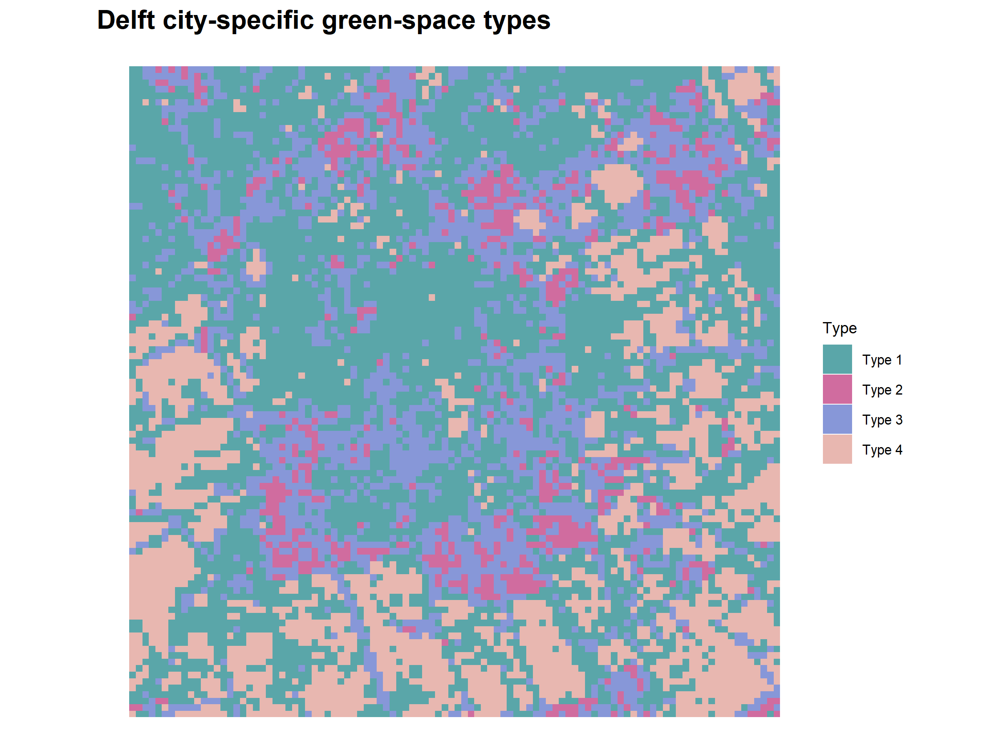
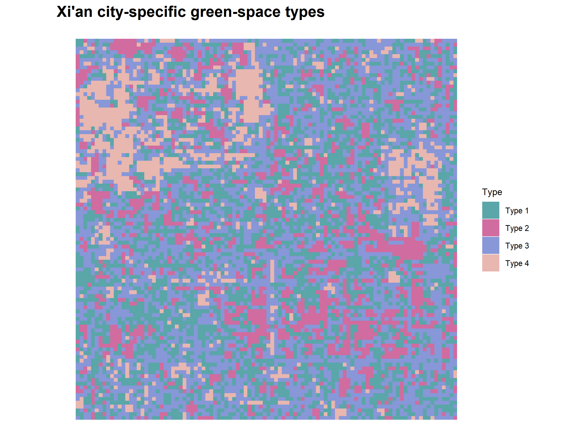
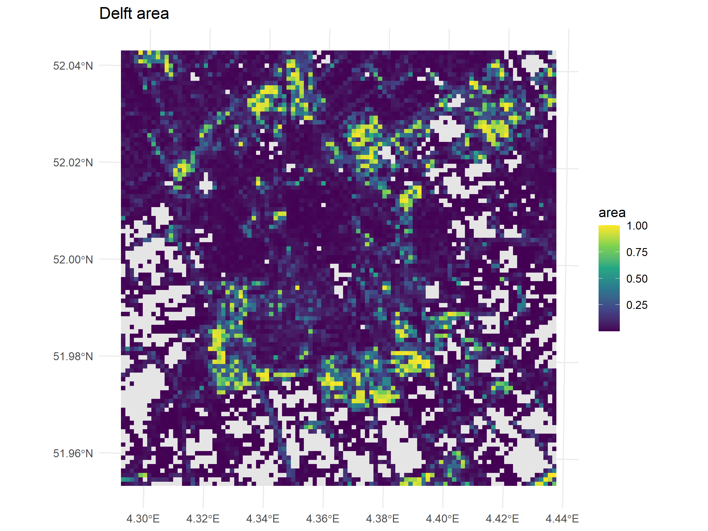
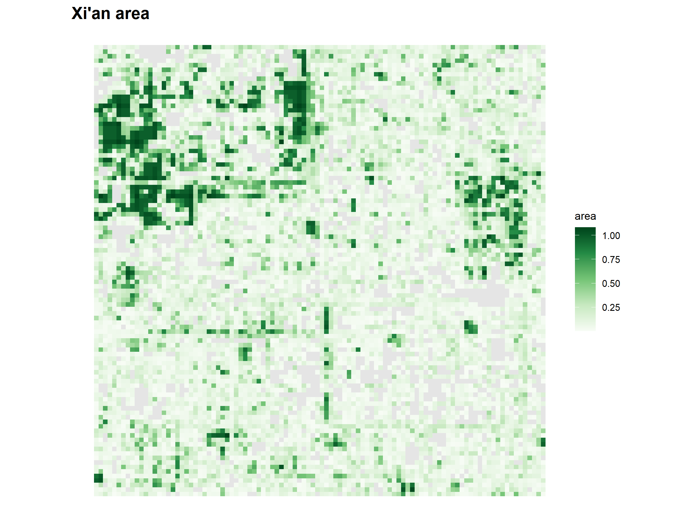
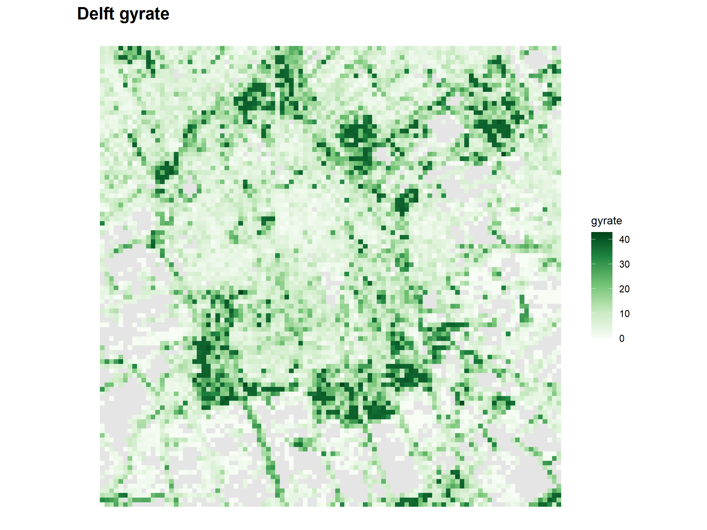
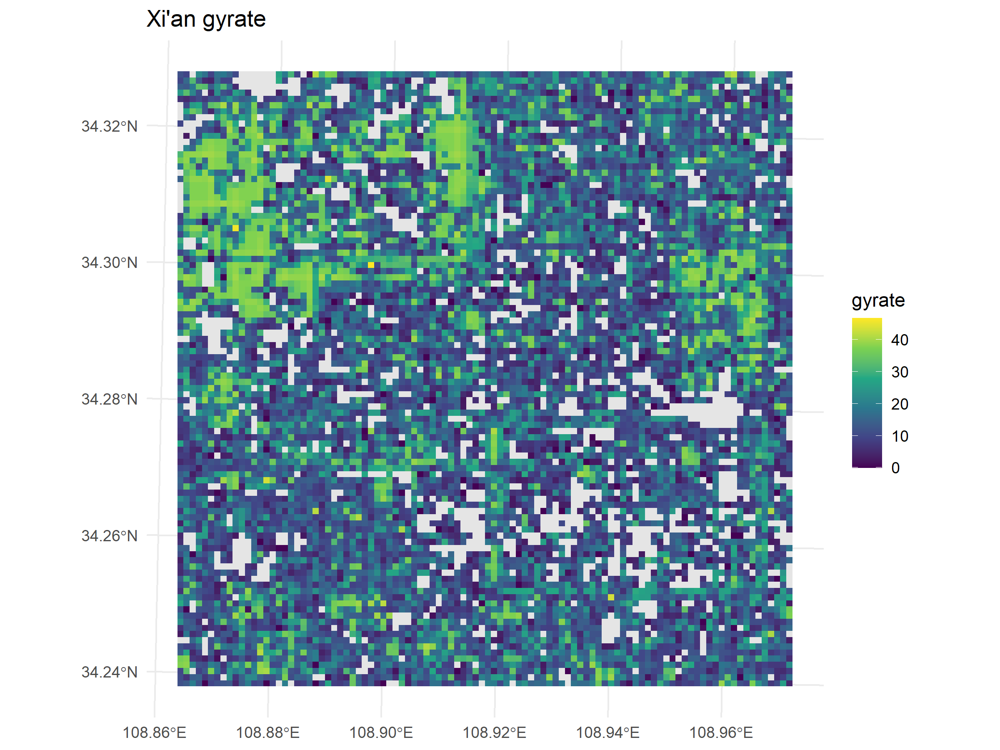
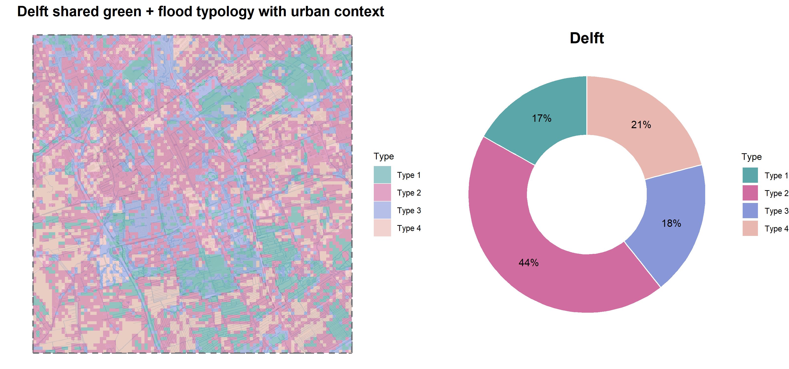
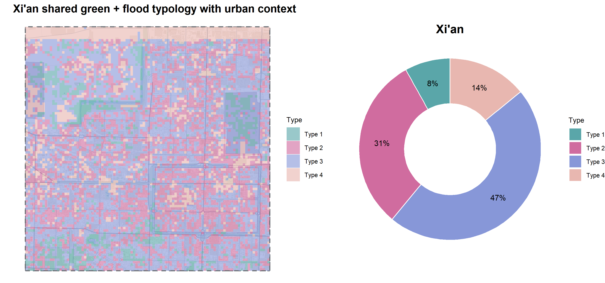

# Additional outputs and unused material

This appendix shows a selection of additional maps and outputs that were produced during the project but were not used as main figures in the report. More complete output files can be found in the GitHub repository, especially in the folders `data/results` and `figures/results`.

The materials included here are mainly intermediate or supporting outputs. They help document the workflow, but the main analysis in the report is based on the selected metrics and the final combined green+flood+DEM typology.

## Green only typologies

Earlier in the project, green only typologies were created using only green space configuration metrics. These outputs were useful during the exploratory stage, but they were not used as the final typology because the final report focuses on combined green+flood+DEM typologies.

{width=100%}

{width=100%}

## Additional metric maps

Some additional metric maps were produced during the analysis but were not included in the main chapters because they were either redundant or mainly used for checking the workflow.

{width=49%}
{width=49%}

{width=49%}
{width=49%}

## Intermediate green+flood typology

A green+flood typology was created as an intermediate step before adding DEM variables. This helped compare whether the inclusion of elevation and slope changed the interpretation. The green+flood+DEM typology was selected as the final version because it includes topographic context.

{width=100%}

{width=100%}
