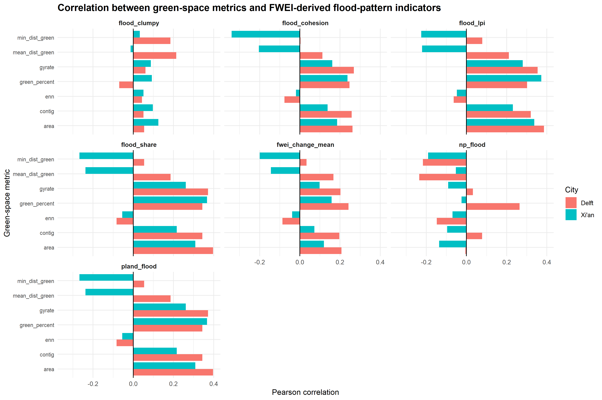
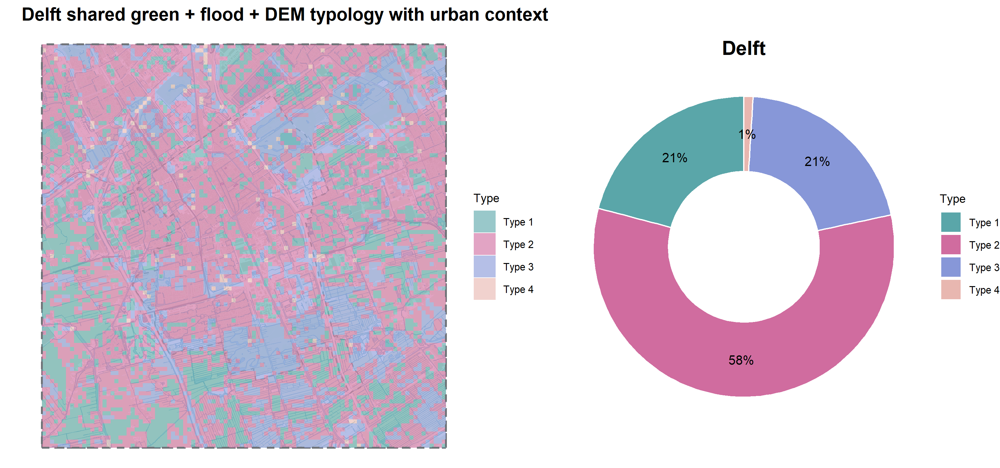
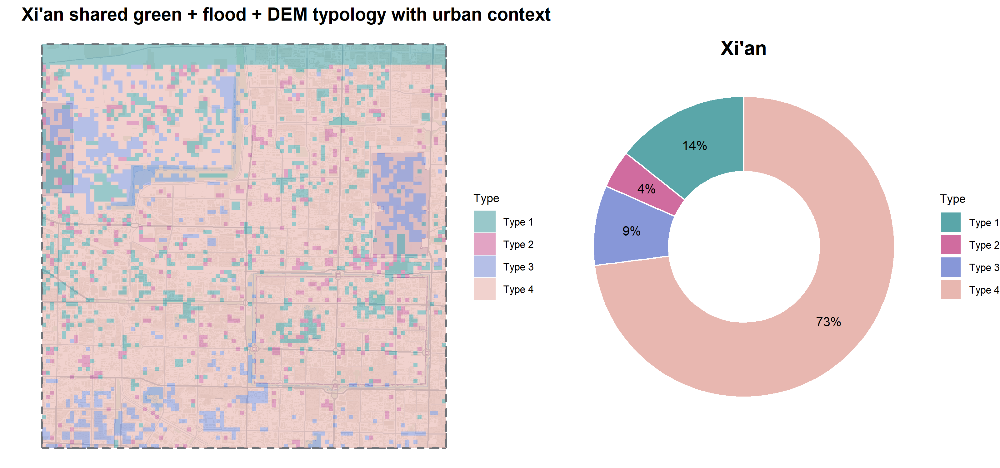
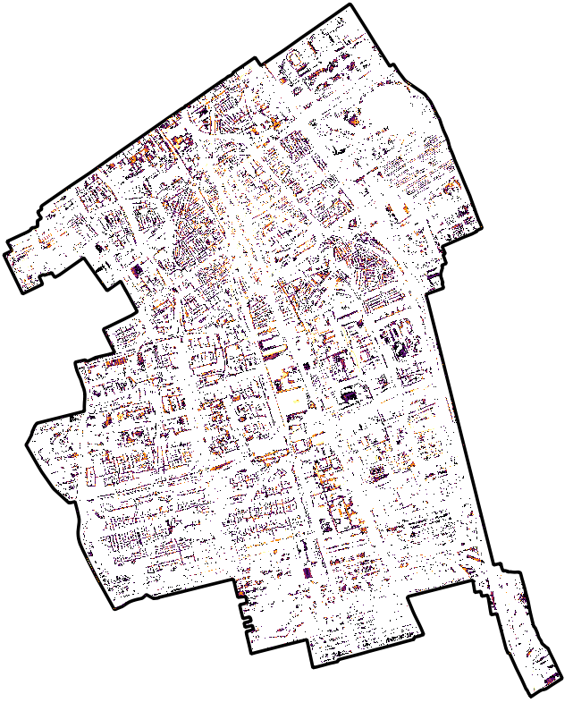

# Discussion

This chapter brings together the main analytical results, their interpretation, the limitations of the workflow, and the reproducibility of the project. The separate results are not discussed as isolated outputs here, but are linked back to the research question: how green space configuration relates to pluvial flood related surface water patterns in Delft and Xi’an.

```{r}
#| echo: false
#| message: false
#| warning: false

library(knitr)
library(dplyr)

root <- if (dir.exists("../data")) ".." else "."

read_table_safe <- function(x) {
  if (file.exists(x)) read.csv(x) else data.frame(note = paste("File not found:", x))
}
```

## Results and analysis

The correlation analysis compared green space configuration metrics with FWEI derived flood indicators. The main aim was to check whether greener, more compact, or more isolated green space patterns were associated with higher or lower detected surface water values.

| City  | Green-space metric         | FWEI change mean | Flood share |
| ----- | -------------------------- | ---------------: | ----------: |
| Delft | Green percentage           |            0.242 |       0.344 |
| Delft | Contiguity                 |            0.196 |       0.344 |
| Delft | Nearest-neighbour distance |           -0.087 |      -0.083 |
| Xi’an | Green percentage           |            0.158 |       0.367 |
| Xi’an | Contiguity                 |            0.073 |       0.216 |
| Xi’an | Nearest-neighbour distance |           -0.039 |      -0.054 |

The strongest relationships are found with `flood_share`, not with `fwei_change_mean`. In both cities, green percentage and contiguity have positive correlations with flood share. This means that cells with more green space or more connected green patches also tend to have a larger share of detected surface water increase. The nearest neighbour distance metric has weak negative correlations, meaning that more isolated green patches are not linked to higher detected water values in the same way.

{#fig-correlation-overview width=100%}

The correlation results do not support the simple assumption that more green space automatically means less detected water. Instead, the results show that green space configuration and FWEI derived surface water increase overlap spatially in some parts of both cities.

The final combined typology gives a clearer interpretation than the correlations alone. It combines green space configuration, FWEI derived flood pattern indicators, and DEM variables into one shared classification.

```{r}
#| echo: false
#| message: false
#| warning: false

final_typology <- read_table_safe(file.path(root, "data/results/final_typology_summary.csv"))

final_typology_small <- data.frame(City = final_typology$city, Type = final_typology$type, Cells = final_typology$n_cells, Share = round(final_typology$percent_cells, 1), Green = round(final_typology$mean_green_percent, 1), Contiguity = round(final_typology$mean_contig, 3), FWEI_change = round(final_typology$mean_fwei_change_mean, 3), Flood_share = round(final_typology$mean_flood_share, 3), Flood_patches = round(final_typology$mean_np_flood, 2), Elevation = round(final_typology$mean_elevation_mean, 2), Slope = round(final_typology$mean_slope_mean, 3))

knitr::kable(final_typology_small, caption = "Main results of the final shared green+flood+DEM typology.")
```

The main result is that Delft and Xi’an have different dominant typology structures, but the shared Type 3 class contains the strongest FWEI derived surface water values in both cities.

## Interpretation of Delft and Xi’an typologies

In Delft, Type 2 is the dominant combined typology. It covers about 58% of the study area and represents the main background condition. It has lower green coverage and lower detected surface water values than Type 3. Type 3 covers about 21% of the study area, but it has the highest flood share, 0.640, and the highest mean FWEI change, 0.075. This means that the strongest detected surface water pattern in Delft is concentrated in a greener and more connected type, not in the lowest green type.

{#fig-results-delft-final-typology width=100%}

Type 1 also covers about 21% of Delft, but it has almost no detected surface water increase. Type 4 has high green coverage and relatively many detected flood patches, but it covers less than 1% of the study area. It is therefore too small to treat as a major Delft wide pattern.

In Xi’an, Type 4 is the dominant combined typology. It covers about 73% of the study area and represents the main background condition. It has moderate green coverage and moderate flood share, but it also has the highest mean number of detected flood patches. This means that much of Xi’an is classified as a widespread type with fragmented detected surface water patterns.

{#fig-results-xian-final-typology width=100%}

The clearest high water type in Xi’an is Type 3. It covers only about 9% of the study area, but it has the highest green percentage, highest contiguity, highest FWEI change, and highest flood share. Its mean flood share is 0.610 and its mean FWEI change is 0.065. This makes Type 3 the strongest combined green+flood+DEM type in Xi’an, even though it is not the largest type.

A specific issue in Xi’an is the narrow Type 1 band along the northern edge of the typology map. This band is a grid alignment artefact from preprocessing. It is not interpreted as a real typology zone. This also means that the reported Type 1 percentage in Xi’an is overestimated. The corrected share was not recalculated, so the table values are kept as produced by the workflow, but the interpretation does not rely on this edge band.

Overall, Delft has a more mixed typology structure, while Xi’an is more strongly dominated by one background type. However, both cities show that the strongest detected surface water values occur in the greener and more contiguous Type 3 class.

## Nature based solution directions

The final typology was also used to identify which types are most relevant for nature based solution discussion. This is not a measured flood risk ranking. It is only a practical interpretation based on the available green space, FWEI derived flood, and DEM indicators.

```{r}
#| echo: false
#| message: false
#| warning: false

problematic <- read_table_safe(file.path(root, "data/results/problematic_typology_candidates.csv"))

problematic_small <- data.frame(City = problematic$city, Type = problematic$type, Interpretation = gsub("_", " ", problematic$interpretation), Solution = gsub("_", " ", problematic$possible_solution_direction))

knitr::kable(problematic_small, caption = "Typology candidates for planning interpretation.")
```

The k-means typology combines green space characteristics, flood metrics, and topographic variables into a single spatial framework. In both cities, Type 3 represents the landscape condition where the highest green cover and the greatest proportion of detected flooding occur together. These areas occupy low lying landscape positions that naturally receive and temporarily store surface water. Consequently, simply increasing the amount of green space within these areas is unlikely to substantially reduce flooding. Instead, future flood management strategies should focus on improving the hydrological performance of green infrastructure — integrating parks with urban drainage systems, improving drainage connectivity, increasing the continuity of green corridors, and designing green spaces with explicit water storage function accounting for local topography.

These interpretations should be treated as spatial associations rather than causal findings. The analysis identifies where green space and detected flooding are found together, but it does not prove that green space is reducing or causing flooding.

For Delft, Type 3 is the main candidate. Since this type already has relatively high green coverage, the planning question is not simply where to add more green space. A more relevant direction is to improve the water storage function of existing green areas. Possible interventions include floodable parks, retention basins, wetland enhancement, and controlled temporary storage areas.

Type 2 in Delft is also relevant because it is the dominant background type. However, its flood values are much lower than Type 3, so it is less urgent as a high water typology. If interventions were considered there, they would more likely focus on small scale improvements such as depaving, rain gardens, and permeable surfaces.

For Xi’an, Type 3 is again the clearest high water green type. Type 4 is also important because it covers most of the study area and has many separate detected flood patches. This suggests a more fragmented surface water pattern across the urban area. Possible interventions could include bioswales, connected pocket parks, green corridors, rain gardens, and local infiltration measures.

These suggestions should be treated as planning directions, not final design proposals. The analysis uses FWEI derived surface water change, not measured flood depth. Therefore, the typology can identify relevant spatial patterns, but it cannot determine exact engineering solutions.

## Limitations

The main limitation is that the Flood/Water Extraction Index (FWEI) is a proxy for flood related surface water change. It does not measure flood depth, water volume, drainage failure, or flood damage. The `flood_share` variable is also based on a threshold applied to FWEI change, so it should be interpreted as detected surface water increase rather than as a confirmed flood depth map.

This limitation became clear during the data search. For Delft, a local dataset for water depth during intense rainfall was available, which would have been more directly useful for analysing pluvial flooding. However, a comparable water depth dataset was not available for Xi’an, so this Delft layer could not be used in the shared analysis. In addition, the Sentinel 2 image acquired after the Xi’an flood was collected five days after the flood peak on 11 August 2023. Some temporary surface water had probably already receded by then, so the detected flood extent likely underestimates maximum inundation.

Future research should therefore try to use comparable pluvial flood depth or flood risk maps for both cities. This would reduce the dependence on FWEI as a proxy and would make it possible to test the relationship between green space configuration and flooding more directly.


{#fig-delft-water-depth-discussion width=80%}

Another limitation is that the analysis does not include all factors that influence pluvial flooding. Surface water accumulation is also affected by other variables such as sewer capacity, drainage systems, rainfall intensity, soil type, surface materials, flow accumulation, and impervious surface percentage. Because these variables were not equally available for Delft and Xi’an, they could not be included in the shared typology. This means that some local causes of surface water accumulation are missing from the interpretation. Future work could include these variables where comparable data are available, which would make it easier to separate the role of green space configuration from other flood related factors.

A fourth limitation is the 100 m by 100 m grid. The grid makes comparison easier, but it also simplifies the urban landscape. Small local features such as narrow streets, small green strips, local depressions, or drainage channels can be averaged inside one grid cell. A different grid size could therefore produce somewhat different results. Future work should test different grid sizes, such as 50 m, 100 m, and 200 m, to see how sensitive the results are to spatial scale. Testing different FWEI thresholds would also help show whether the flood share results are stable or depend strongly on the chosen threshold.

The K-means clustering method could also be a limitation. The final typology depends on the selected input variables and the chosen number of clusters. Four clusters were selected because they were interpretable and manageable, but another number of clusters could produce a different typology structure. Future work could compare K-means with other clustering methods or test different numbers of clusters to see whether the typology structure remains stable.

A final limitation is the Xi’an grid alignment issue that produced the Type 1 edge artefact. This issue happened because one part of the Xi’an preprocessing was prepared using an older version of the study area grid, which was positioned slightly further south. When the scripts and datasets were later combined, this mismatch became visible as a narrow Type 1 band along the northern edge of the Xi’an typology map. The artefact was kept in the final output because several layers and outputs had already been clipped, processed, and linked to the existing workflow. However, it was not interpreted as a meaningful spatial typology pattern. Future work should rebuild the Xi’an preprocessing from one single final grid, then rerun the metric calculation and typology construction.

