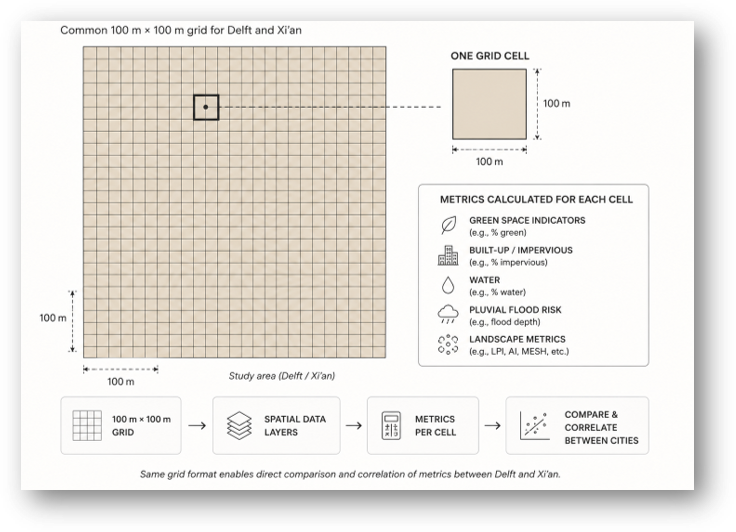
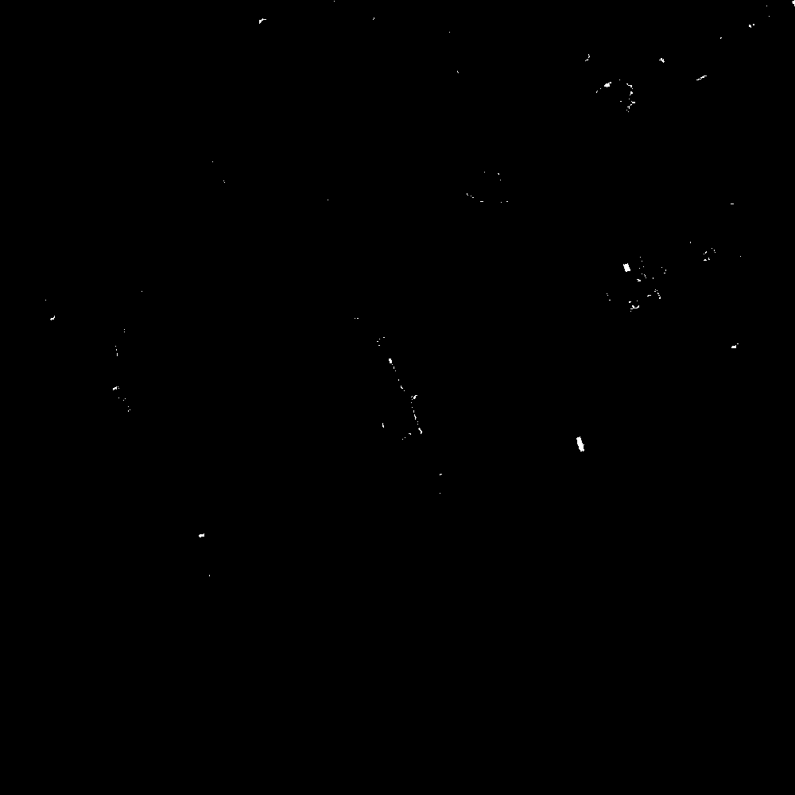
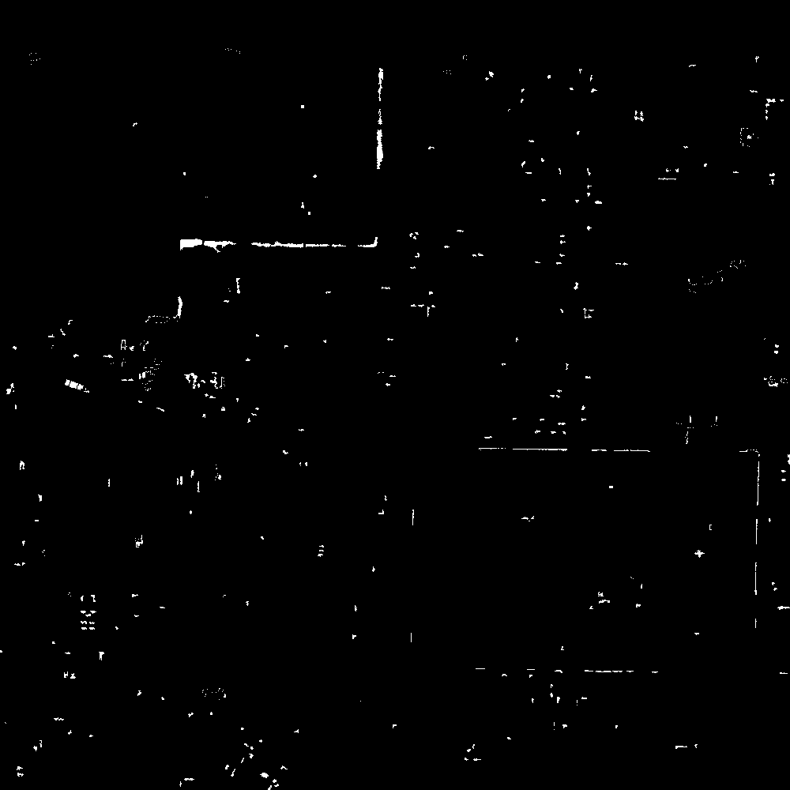
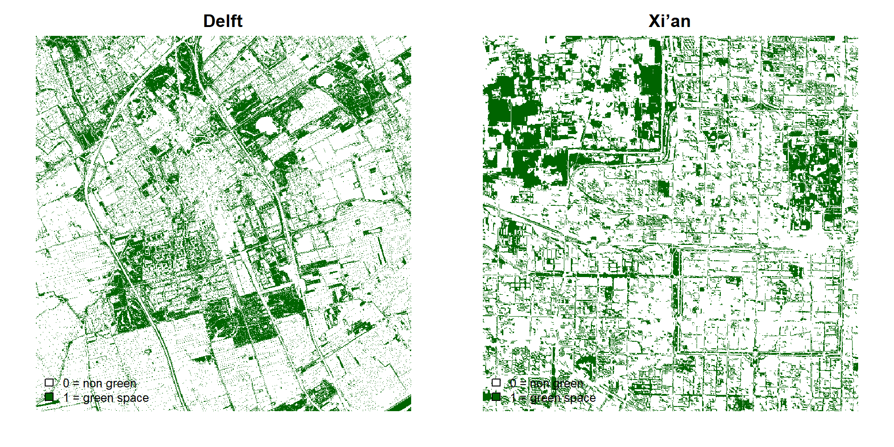

# Methods

## General workflow

The analysis was carried out using a grid based spatial workflow. The same general method was applied to both Delft and Xi’an, so that the results could be compared between the two cities. The main steps were: preparing the input data, clipping the layers to the selected study areas, calculating metrics per grid cell, checking metric redundancy, and constructing combined typologies.

The workflow was implemented mainly in R, using the packages `terra`, `sf`, `landscapemetrics`, `dplyr`, and `ggplot2`. QGIS was used for initial data preparation, FWEI calculation, flood mask creation, study area clipping of change rasters, and map production. The complete FWEI and flood mask workflow is described in detail in the preceding chapter.

{#fig-grid-methodology width=100%}

The workflow converts the input layers into comparable grid cell metrics, which are then used for metric selection, correlation analysis, and combined typology construction.

## Flood water extraction index (FWEI) 

The main flood related input used in this project was the Flood/Water Extraction Index, or FWEI. FWEI is a spectral index developed to identify water and flooded areas from Sentinel 2 visible and near infrared bands [@farhadi2024fwei]. It uses four Sentinel 2 bands at 10 m spatial resolution: blue, green, red, and near infrared.

The FWEI formula is:

$$
FWEI = \frac{MeanVisible - B08}{MeanVisible + B08}
$$

where:

$$
MeanVisible = \frac{B02 + B03 + B04}{3}
$$

In this formula, B02 is the blue band, B03 is the green band, B04 is the red band, and B08 is the near infrared band. Water surfaces usually reflect strongly in the visible bands and absorb near infrared radiation. Because of this, open water and flooded surfaces tend to produce higher FWEI values, while dry surfaces and vegetation tend to produce lower values.

For Xi’an, the two Sentinel 2 acquisition dates, 22 July 2023 before the event and 16 August 2023 after the event, bracket the documented flood of 11 August 2023. For Delft, the acquisition dates of 14 June 2023 and 7 September 2023 represent a non event period. The same FWEI and flood mask workflow was applied to both image pairs, so that a surface water change signal could be produced for each city.

In this project, FWEI was used in two ways. First, the before and after FWEI rasters were used to calculate a continuous FWEI change raster:

$$
FWEI_{change} = FWEI_{after} - FWEI_{before}
$$

This continuous raster was used to calculate fwei_change_mean for each grid cell. This metric represents the average FWEI derived surface water change inside the cell.

Second, the same FWEI change raster was converted into a binary surface water increase layer. A threshold of 0.05 was used. Pixels with an FWEI change above this threshold were classified as detected surface water increase, while pixels below the threshold were classified as no detected surface water increase.

This binary flood mask was then used to calculate flood_share and the flood pattern metrics. Therefore, the analysis did not only use the continuous FWEI value. It used both the continuous FWEI change raster and the thresholded binary flood mask. Below 

::: {layout-ncol=2}

{width=100%}

{width=100%}

:::

## Green binary dataset

Green space was represented with binary green space rasters. In these rasters, green areas were given the value 1, while all non green areas were given the value 0. This binary format allowed the green space layer to be analysed as categorical raster data when calculating the patch based landscape metrics in R.

At the beginning of the project, more general land cover and satellite based datasets were explored for the green space layer, including ESA WorldCover 2021 v200 and the China Land Cover Dataset 2022 for Xi’an. However, these datasets were not detailed enough for the final analysis. Since the project focused on the spatial structure of green space, including fragmentation, configuration, and patch patterns, a more detailed green space input was needed.

For Delft, the final green space layer was based on a local dataset from the Klimaatatlas. This dataset was processed in QGIS and converted into a binary raster, so that green space and non green space could be clearly separated. For Xi’an, the final green space layer came from the Urban green space (UGS) 1m dataset, which provides detailed urban green space data for several large Chinese cities at around 1 m resolution [@shi2023ugs]. This layer was also converted into a binary raster before it was used for the landscape metric analysis in R. The binary green space rasters, cropped to the Delft and Xi’an study areas, are shown below.

{width=100%}

## Data preparation

Before the analysis, all spatial layers were prepared for the two selected study areas. The main input layers were green space rasters, pre event and post event FWEI rasters, the clipped flood change rasters, DEM rasters, and context layers for mapping. The layers were checked, clipped to the study areas, and transformed to the correct coordinate reference systems where needed.

For Delft, the projected coordinate system used in the workflow was EPSG:28992. For Xi’an, the projected coordinate system used in the workflow was EPSG:32649. Using projected coordinate systems was important because the analysis involved distances, grid cells, patch metrics, and slope calculations.

The main preprocessing steps were:

| Step                           | Purpose                                                               |
| ------------------------------ | --------------------------------------------------------------------- |
| Study-area clipping            | To make all layers match the selected 10 km by 10 km areas.           |
| CRS alignment                  | To make sure layers overlap correctly and can be measured in metres.  |
| Raster alignment               | To make raster layers comparable before extracting grid-cell values.  |
| Binary green-space preparation | To separate green and non-green areas.                                |
| FWEI difference calculation    | To estimate surface water change between the before and after images. |
| DEM preparation                | To calculate elevation and slope values for each grid cell.           |

## Grid based spatial unit

Both cities were analysed using a 100 m by 100 m grid, resulting in 10,000 grid cells per study area. The grid was used as the common spatial unit for summarising green space, FWEI derived flood, and DEM variables. This allowed raster and vector inputs with different resolutions to be converted into comparable metric tables for Delft and Xi’an.

## Metric calculation and selection

After preparing the input layers, green-space, FWEI-derived flood, and Digital Elevation Model (DEM) variables were calculated for each grid cell. This produced one metric table for Delft and one for Xi’an.

The green-space rasters were binary, with green space coded as `1` and non-green space as `0`. They were aggregated to approximately 5 m resolution to reduce processing time. For each grid cell, green coverage and patch-based landscape metrics were calculated.

For the flood-related metrics, the continuous FWEI change raster was used to calculate mean surface-water change per cell. The same raster was also converted into a binary flood mask using a threshold of `0.05`. This mask was used to calculate `flood_share` and flood-pattern metrics.

DEM data were used to calculate elevation and slope per grid cell. A broader set of metrics was first produced, after which redundant metrics were removed. The final metric selection is explained in the next chapter.

## Pearson correlation analysis

Pearson correlation analysis was used to test the relationship between selected green space metrics and FWEI derived flood indicators. Pearson’s correlation coefficient, or `r`, measures the direction and strength of a linear relationship between two variables. Values range from -1 to +1. Positive values indicate that both variables tend to increase together, while negative values indicate that one variable tends to decrease as the other increases.

In this project, the strength of the correlation values was interpreted as follows:

- `|r| < 0.10`: negligible relationship
- `|r| = 0.10 to 0.29`: weak relationship
- `|r| = 0.30 to 0.49`: moderate relationship
- `|r| >= 0.50`: strong relationship

Statistical significance was assessed using `p < 0.05`. However, significance was interpreted separately from practical strength, because a statistically significant result can still represent a weak relationship.

## Combined typology construction

K-means clustering was used to group grid cells into combined typologies. The final typology used the selected green, FWEI derived flood, and DEM metrics. Before clustering, the variables were standardised using `scale()`, so that variables with larger numerical ranges did not dominate the result.

A green+flood typology was first created as an intermediate check. The final typology used green+flood+DEM variables, because topography was considered important for interpreting surface water accumulation.

Four clusters were used. The elbow plot did not show one perfect cluster number, but four clusters were selected because they gave a manageable and interpretable set of spatial types. The same clustering was applied as a shared typology for Delft and Xi’an, meaning both cities were classified using the same type definitions.

## Outputs

The workflow produced spatial and tabular outputs for both cities. The main outputs were grid layers, metric tables, correlation tables, redundancy tables, maps, and combined typology layers.

| Output                          | Purpose                                                                                         |
| ------------------------------- | ----------------------------------------------------------------------------------------------- |
| Grid metric files               | Store all calculated green, flood, and DEM metrics per grid cell.                               |
| Metric maps                     | Show spatial variation in each selected metric.                                                 |
| Redundancy tables               | Show which metrics were removed or kept.                                                        |
| Combined typology maps          | Show the final green+flood+DEM typology in each city.                                           |
| Typology summary tables         | Describe the average characteristics of each type.                                              |

This workflow made it possible to move from separate spatial layers to comparable grid cell metrics and finally to shared typologies for Delft and Xi’an.
