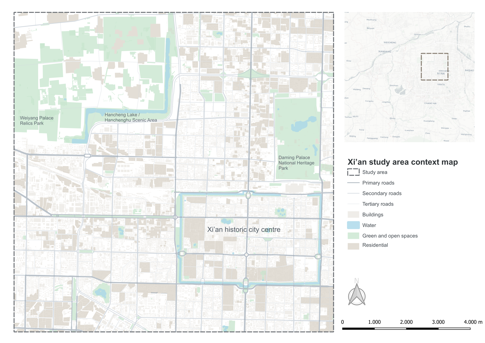

# Preliminary maps and research

## Study area selection

The study areas were selected to make the comparison between Delft and Xi’an more balanced. Because the full cities are very different in size, both cases were analysed using the same 10 km by 10 km study-area extent. This allowed the project to compare two contrasting urban contexts without relying on full administrative boundaries.

For Delft, the selected area includes the city itself and parts of the surrounding urban and rural landscape. For Xi’an, the selected area focuses on a central urban section that includes dense urban fabric, green patches, and major open spaces. The aim was not to make the two cities identical, but to apply the same spatial logic to two different urban settings.

::: {layout-ncol=2}
{#fig-delft-study-area width=100%}

{#fig-xian-study-area width=100%}
:::

The maps above show the selected study areas in their wider urban context. They also show that the comparison is based on equally sized areas, rather than on the full administrative extent of both cities.

## Delft and Xi’an as comparison cases

Delft and Xi’an represent clearly different urban contexts. Delft is a smaller Dutch city in a low lying delta setting with a dense water network and a highly managed urban landscape. Xi’an is a much larger Chinese city with a different urban structure, land cover pattern, and topographic setting.

For Delft, the 10 km by 10 km study area fully contains the city. This is useful because Delft is relatively compact, so the selected area includes both the municipality and the surrounding landscape. The municipality boundary is shown inside the study area to make clear where Delft itself is located. This also gives context for surrounding canals, green areas, urban edges, and open landscapes, which are relevant for understanding green space configuration and flood related surface water patterns.

For Xi’an, the same 10 km by 10 km study area does not cover the full city. Instead, it captures a central urban subset. This area was selected because it includes the historic city centre and city wall, but also large green and heritage spaces such as Weiyang Palace Relics Park, Hancheng Lake, and Daming Palace National Heritage Park. This makes the area useful for comparing dense urban fabric with larger green and open spaces within the same study area size.

The comparison is therefore not based on the idea that Delft and Xi’an are similar cities. Instead, they are used as contrasting cases. This makes it possible to test whether the same spatial workflow can still identify meaningful green space and flood related patterns in both places.

