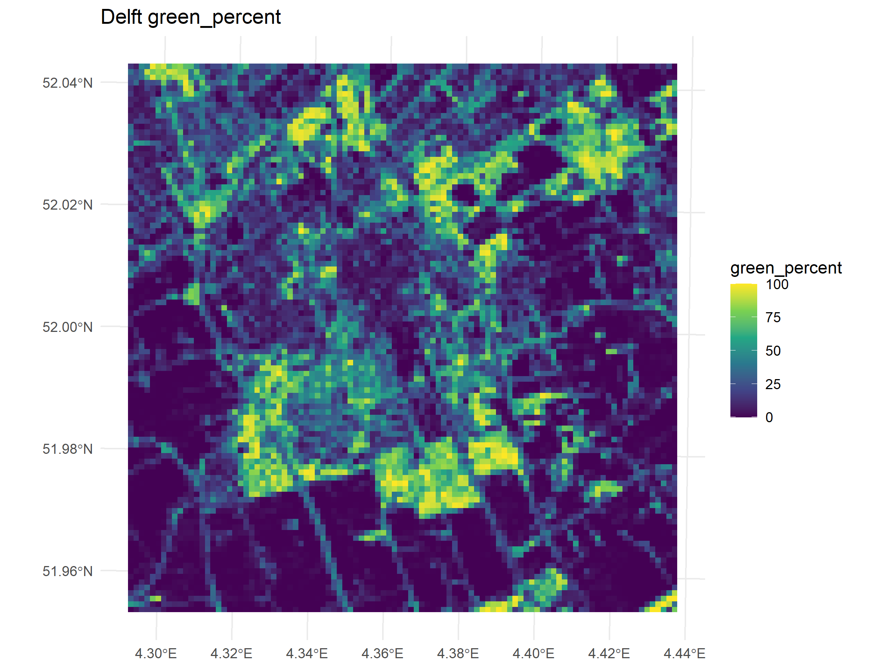
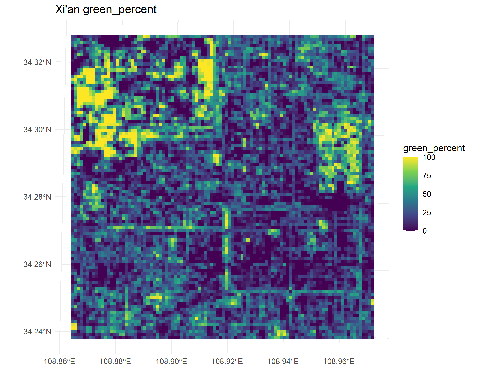
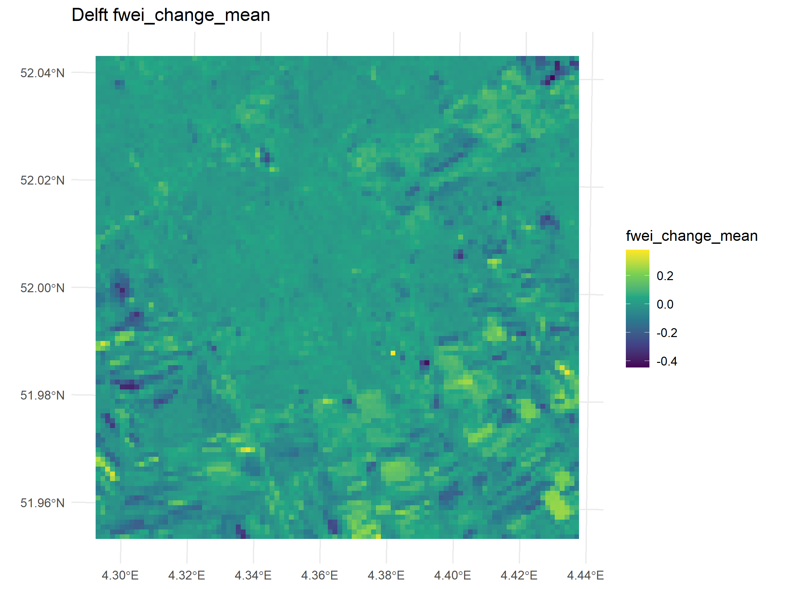
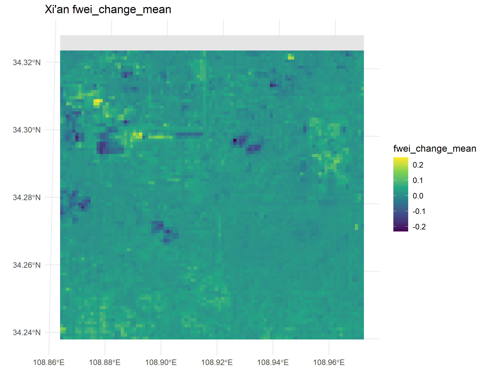
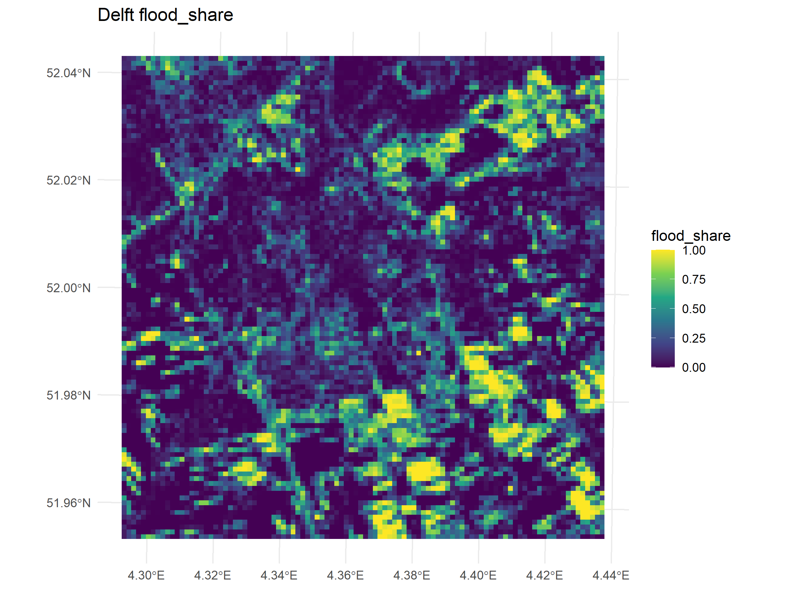
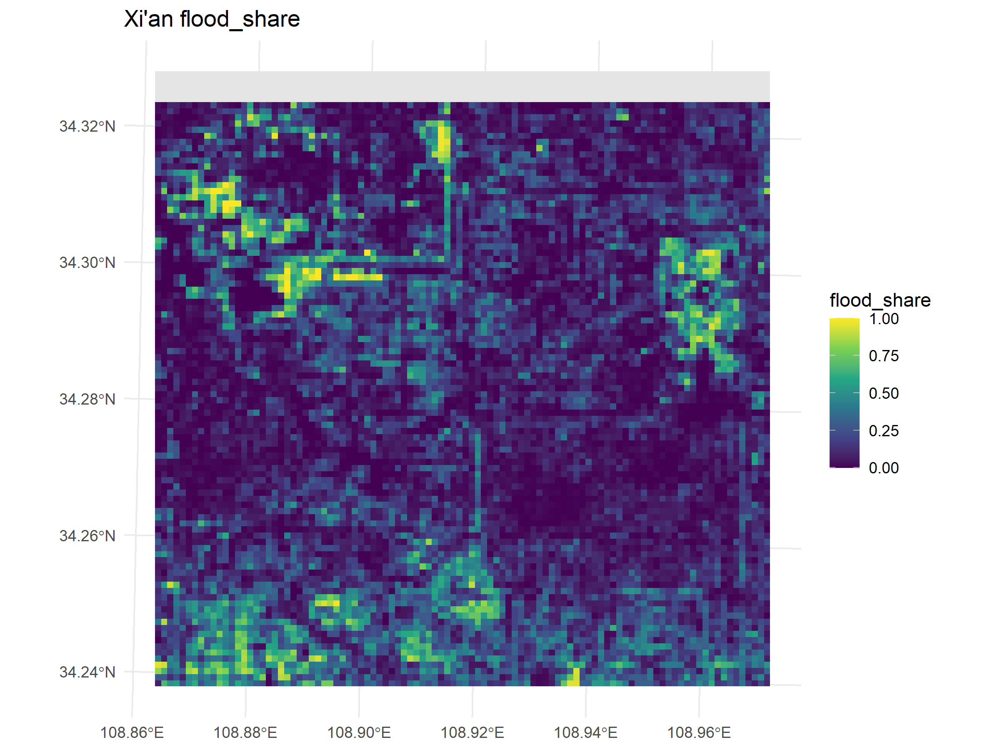

# Results

## Green-space patterns

The first part of the results shows how green space is distributed across the 100 m by 100 m grid cells in Delft and Xi’an. The analysis successfully produced grid-level green-space metrics for 10,000 cells in Delft and 10,000 cells in Xi’an. Each grid cell contains values for total green coverage and several patch-based landscape metrics.

The green percentage maps show clear spatial variation in both cities. Some cells contain almost no green space, while other cells are dominated by green areas. This confirms that a simple city-wide percentage of green space would not be enough for this analysis. The spatial distribution of green space differs within each city and needs to be analysed at the grid-cell level.

<!-- FIGURE:
Put the Delft green percentage map here.
Suggested file:
../figures/results/delft_green_percent.png
-->

{#fig-delft-green-results width=100%}

<!-- FIGURE:
Put the Xi’an green percentage map here.
Suggested file:
../figures/results/xian_green_percent.png
-->

{#fig-xian-green-results width=100%}

The patch metrics provide more detail about the configuration of green space. The `area` metric describes the mean size of green patches within each grid cell. The `contig` metric describes how internally connected the green patches are. The `enn` metric describes the mean distance to the nearest neighbouring green patch. Together, these metrics allow a distinction between cells with large connected green areas and cells with smaller or more isolated green patches.

<!-- OPTIONAL FIGURES:
Use these if the maps look good and are not too repetitive.

../figures/results/delft_area.png
../figures/results/xian_area.png
../figures/results/delft_contig.png
../figures/results/xian_contig.png
../figures/results/delft_enn.png
../figures/results/xian_enn.png
-->

## FWEI-based surface water change

The second part of the results shows the spatial distribution of flood-related surface water change. This was calculated using the difference between the after-event and before-event FWEI rasters. The resulting variable, `fwei_change_mean`, represents the average FWEI change within each grid cell.

Positive FWEI change values indicate an increase in the surface water signal after the event. These values are interpreted as flood-related surface water change, not as direct flood depth. A second variable, `flood_share`, was also calculated. This represents the proportion of each grid cell classified as increased surface water using the FWEI change threshold.

<!-- FIGURE:
Put the FWEI change maps here.
Suggested files:
../figures/results/delft_fwei_change_mean.png
../figures/results/xian_fwei_change_mean.png
-->

{#fig-delft-fwei-change width=100%}

{#fig-xian-fwei-change width=100%}

<!-- OPTIONAL FIGURE:
Put flood share maps here if they are visually clear.
Suggested files:
../figures/results/delft_flood_share.png
../figures/results/xian_flood_share.png
-->

{#fig-delft-flood-share width=100%}

{#fig-xian-flood-share width=100%}

## Correlation analysis

Pearson correlations were calculated between the green-space metrics and the two FWEI-based flood-related indicators: `fwei_change_mean` and `flood_share`. The results show mostly weak to moderate correlations. This means that there is some spatial association between green-space configuration and surface water change, but the relationship is not strong enough to suggest a simple direct pattern.

For Delft, the strongest relationship was found between mean patch area and `flood_share` with a correlation of 0.397. Green percentage, radius of gyration, and contiguity also showed positive correlations with `flood_share`. For `fwei_change_mean`, the correlations were weaker, with green percentage showing a value of 0.242 and mean patch area showing a value of 0.207. The nearest-neighbour distance metric had a weak negative relationship with both flood-related variables.

For Xi’an, the strongest relationship was also found between green percentage and `flood_share`, with a correlation of 0.367. Mean patch area and radius of gyration also had positive relationships with `flood_share`. The correlations with `fwei_change_mean` were weaker than those with `flood_share`. The `mean_dist_green` variable had a negative correlation with both FWEI variables in Xi’an, meaning that surface water increase tended to occur closer to green areas.

| City  |         Green-space metric | FWEI change mean | Flood share |
| ----- | -------------------------: | ---------------: | ----------: |
| Delft |           Green percentage |            0.242 |       0.344 |
| Delft |            Mean patch area |            0.207 |       0.397 |
| Delft |         Radius of gyration |            0.202 |       0.372 |
| Delft |                 Contiguity |            0.196 |       0.344 |
| Delft | Nearest-neighbour distance |           -0.087 |      -0.083 |
| Delft |     Mean distance to green |            0.168 |       0.186 |
| Xi’an |           Green percentage |            0.158 |       0.367 |
| Xi’an |            Mean patch area |            0.120 |       0.309 |
| Xi’an |         Radius of gyration |            0.098 |       0.262 |
| Xi’an |                 Contiguity |            0.073 |       0.216 |
| Xi’an | Nearest-neighbour distance |           -0.039 |      -0.054 |
| Xi’an |     Mean distance to green |           -0.144 |      -0.237 |

<!-- FIGURE:
Put the correlation overview plot here.
Suggested file:
../figures/results/correlation_overview.png
-->

{#fig-correlation-overview width=100%}

## Main findings from the results

The correlation results show that the relationship between green-space configuration and flood-related surface water change is more complex than expected. A simple assumption would be that more green space leads to less surface water increase. However, the results do not show this pattern. In both Delft and Xi’an, greener cells and cells with larger or more contiguous green patches often show higher FWEI change or higher flood share.

This does not mean that green space causes flooding. A more careful interpretation is that green spaces may often be located in areas where surface water is more likely to be detected. These may include open areas, parks, low-lying areas, or places where water can accumulate visibly after rainfall. In contrast, dense built-up areas may contain water on roads, roofs, or drainage surfaces that is harder to detect using FWEI. Therefore, the results should be interpreted as spatial associations between green-space configuration and surface water change, rather than causal effects.

The results also show that the `flood_share` variable gives stronger correlations than `fwei_change_mean` in both cities. This suggests that the spatial extent of FWEI-derived surface water increase may be more closely related to green-space patterns than the average intensity of FWEI change.
