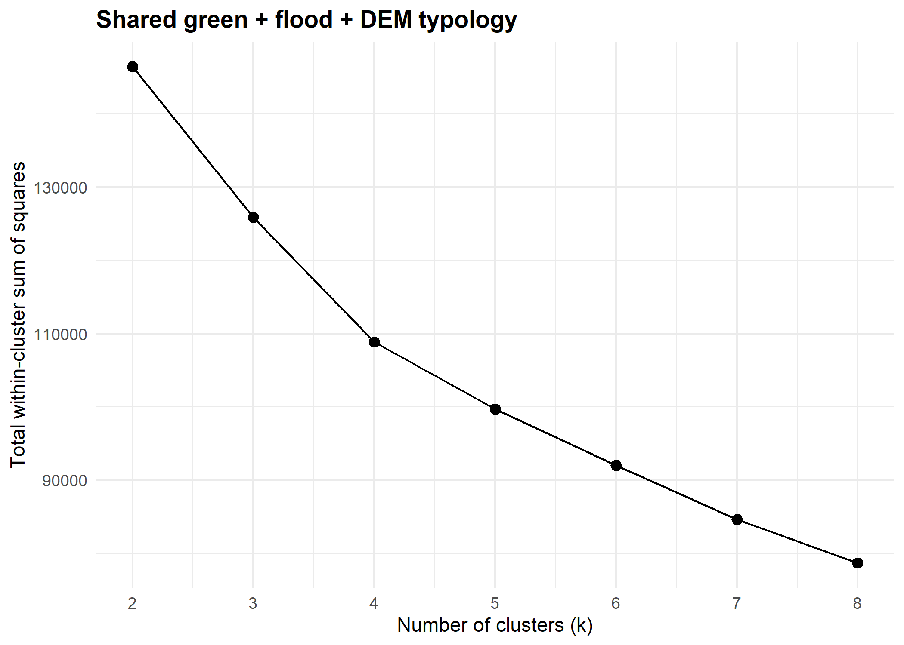
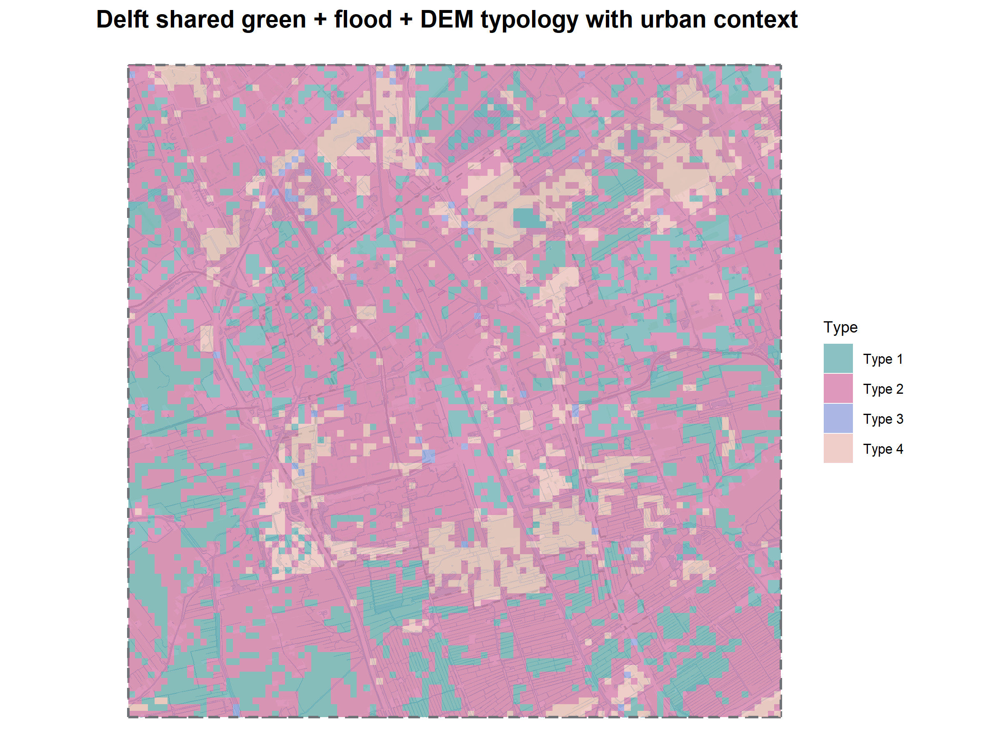
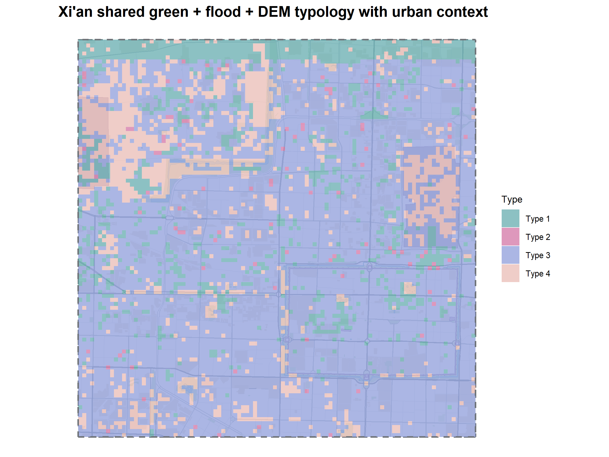

# Typology construction

This chapter explains how the combined typologies were constructed and how the four final types were defined.

```{r}
#| echo: false
#| message: false
#| warning: false

library(knitr)
library(dplyr)

root <- if (dir.exists("../data")) ".." else "."

read_table_safe <- function(x) {
  if (file.exists(x)) read.csv(x) else data.frame(note = paste("File not found:", x))
}
```

## Purpose of the typology

The typology construction was used to group grid cells with similar combined spatial conditions. Instead of analysing each metric separately, K means clustering was used to combine the selected metrics into four broader spatial types.

The earlier green only typologies were useful for understanding green space structure, but they did not combine the green, flood, and topographic dimensions of the research question. Therefore, the final typology was based on the selected non redundant green, FWEI derived flood, and DEM metrics.

The final green+flood+DEM typology used the following variables:

| Metric group               | Metrics used                                                  | Meaning                                                                              |
| -------------------------- | ------------------------------------------------------------- | ------------------------------------------------------------------------------------ |
| Green-space configuration  | `green_percent`, `contig`, `enn`                              | Amount, compactness, and isolation of green space.                                   |
| FWEI-derived flood pattern | `fwei_change_mean`, `flood_share`, `np_flood`, `flood_clumpy` | Magnitude, extent, fragmentation, and clustering of detected surface-water increase. |
| DEM context                | `elevation_mean`, `slope_mean`                                | Average elevation and terrain steepness.                                             |

A green+flood typology was first created as an intermediate check. However, the green+flood+DEM typology was selected as the final typology because it also includes topographic context. This is relevant because surface water accumulation may be influenced by elevation and slope, not only by green space configuration.

## Clustering method

K-means clustering was used to classify the grid cells into four types. The clustering was shared across Delft and Xi’an, meaning that the two cities were classified using the same type definitions. This makes the typologies directly comparable between the two study areas.

Before clustering, all input variables were standardised. This was necessary because the metrics have different units and numerical ranges. Without standardisation, variables with larger values could dominate the clustering result.

The number of clusters was set to four. The elbow plot was used as a basic check, and four clusters were selected because this produced a manageable number of interpretable spatial types.

{#fig-green-flood-dem-elbow width=80%}

## Final typology overview

The final shared green+flood+DEM typology produced four types. These types were not named automatically by the K-means algorithm. They were interpreted afterwards using their average green, flood, and DEM values.

```{r}
#| echo: false
#| message: false
#| warning: false

final_typology <- read_table_safe(file.path(root, "data/results/final_typology_summary.csv"))

final_typology_small <- final_typology %>%
  transmute(
    City = city,
    Type = type,
    Cells = n_cells,
    `Share (%)` = round(percent_cells, 1),
    `Green (%)` = round(mean_green_percent, 1),
    Contiguity = round(mean_contig, 3),
    ENN = round(mean_enn, 1),
    `FWEI change` = round(mean_fwei_change_mean, 3),
    `Flood share` = round(mean_flood_share, 3),
    `Flood patches` = round(mean_np_flood, 2),
    `Flood clumpiness` = round(mean_flood_clumpy, 3),
    Elevation = round(mean_elevation_mean, 2),
    Slope = round(mean_slope_mean, 3)
  )

knitr::kable(final_typology_small, caption = "Summary of the final shared green+flood+DEM typology.")
```

| Type | Suggested name | Main character |
|---|---|---|
| Type 1 | Low-water / low-flood background | Low detected surface-water increase and limited flood-pattern activity. |
| Type 2 | Moderate urban background | Moderate green coverage and moderate flood-related values. |
| Type 3 | Green high-water type | High green coverage, high contiguity, and the strongest detected surface-water values. |
| Type 4 | Fragmented flood-patch type | Many detected flood patches, with more fragmented surface-water patterns. |

## Delft typology

The  green+flood+DEM typology was made for Delft to show how the shared typology classes are distributed across the study area. The map is mainly used here to show the spatial output of the clustering process.

{#fig-delft-final-typology width=100%}

The Delft typology map shows a spatially mixed pattern. The large Type 2 background covers most of the built-up core. Type 3, the type with the highest green coverage and highest flood share, appears in parks, water adjacent open land, and lower lying green zones. Type 1 is concentrated in denser built up areas. Type 4 is scattered and rare.

## Xi’an typology

The  green+flood+DEM typology was also made for Xi'an using the same method.

{#fig-xian-final-typology width=100%}

The Xi’an map shows a different typology structure from Delft, with one type covering a larger part of the study area. The narrow Type 1 band along the northern edge of the Xi’an map is a preprocessing artefact caused by a grid alignment issue. It is therefore not interpreted as a meaningful typology zone. The cause of this mismatch issue is discussed in more detail further in the discussion chapter.

## Comparison of typology structure

The shared typology allows Delft and Xi’an to be compared using the same four type definitions. The typology maps show that the two cities have different spatial structures. Delft has a more mixed distribution of types, while Xi’an is more strongly dominated by one type.

The detailed interpretation of these differences, including which typology classes are most relevant for nature based solutions in Delft and Xi’an, is also presented in the next chapter.


